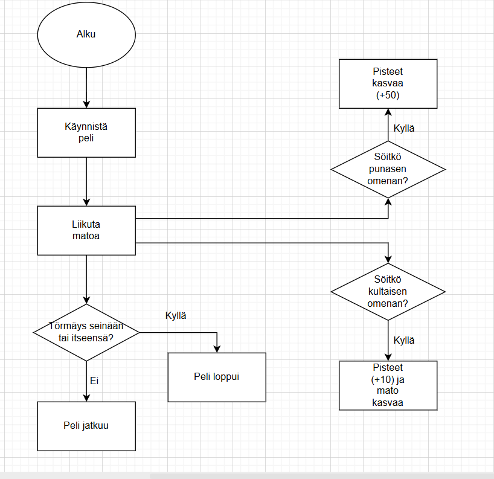
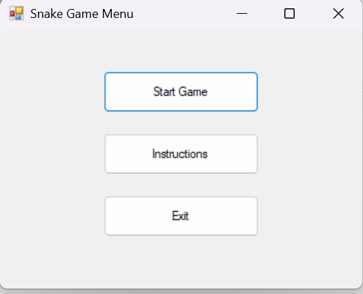
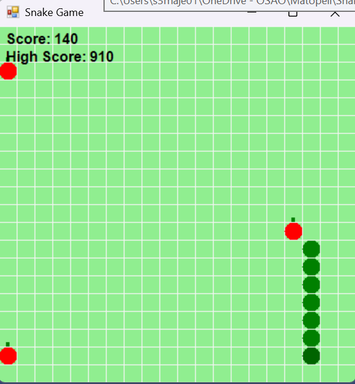
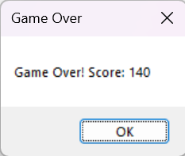

# Matopeli

## Sovelluksen käyttö

Matopeli käyttäjä ohjaa matoa nuolinäppäimillä ja kerää omenoita kasvattaen matoa. Tavoitteena on saada mahdollisimman paljon pisteitä. Kultaisesta omenasta saa enemmän pisteitä eikä mato kasva siitä. Peli päättyy, kun mato törmää seinään tai itseensä. Pelin saa välilyönnillä pysäytettyä.

## Vuokaavio sovelluksesta

## Sovelluksen näkymät

### Päävalikko

### Pelinäkymä

### Lopetus

## Pääkohdat koodista

- GameForm-luokka sisältää pelin logiikan
- High score tallentuu tekstitiedostoon
- KeyDown ohjaa matoa nuolinäppäimillä ja paussaa pelin välilyönnillä.
- OnPaint piirtää kuvat(kuten ruokaa) ja pisteet.
- Timer tarkistaa törmäykset, päivittää matoa ja pisteet.

## Jatkokehitysideat

- Pelin nopeutuminen
- Myrkkyruokia
- Kentälle erilaisia esteitä
- Peliäänet (musiikki, omenan syönti, peli päättyi)
